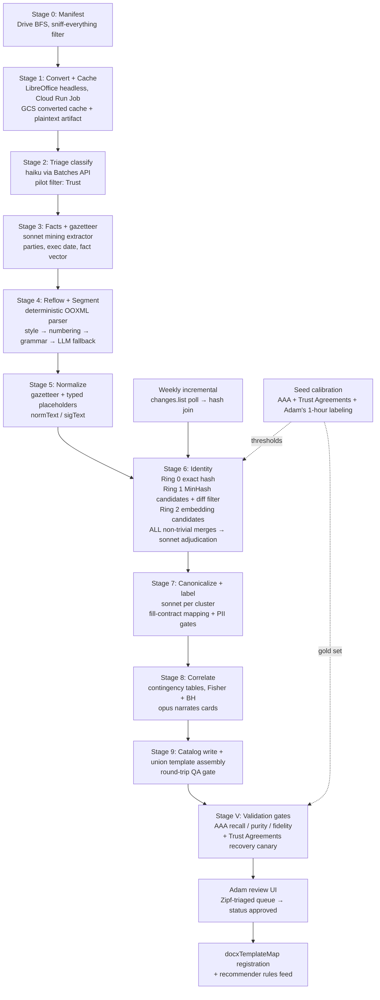

# Clause-Mining Pipeline — Design of Record

**Corpus-mining pipeline for the firm clause catalog — ultracode checkpoint #1 design of record.**

Status: PROPOSED — awaiting Adam's sign-off on the checkpoint decisions in §15.
Pilot scope: **trusts only** (revocable living trusts, amendments, restatements). Full corpus follows.

---

## 1. Goals & non-goals

### Goals

1. Convert ~2 decades of drafted client documents (Drive "Wills and Trusts" tree) into a **clause catalog**: canonical, attorney-approved, placeholder-only clause texts with usage frequency, co-occurrence stats, and empirically derived trigger cards ("Adam includes this when X").
2. Feed two downstream consumers:
   - **(a)** a union master `.docx` per document type with boolean clause switches, rendered by the existing docxtemplater path (`functions/src/docx-fidelity.ts`);
   - **(b)** an AI recommender that suggests clause on/off switches per client from intake data + meeting notes.
3. Every catalog entry traces to source documents (Drive file + paragraph span). Every merge decision is replayable and reversible.
4. The catalog is **PII-free by construction**: placeholder text only; raw client text never leaves access-controlled Cloud Storage.
5. New Adams-folder clients (weekly) join the catalog by hash lookup, not re-clustering.

### Non-goals

- No changes to the live drafting pipeline (`client-data-serializer.ts`, generators, existing `.hbs` templates).
- No processing of scanned/signed PDFs (excluded as duplicates of drafts).
- No automatic publication: nothing reaches the master template or recommender until `status: 'approved'` by Adam.
- No cross-firm generality. This is firm-scoped tooling under `firms/{firmId}/…`.
- Full dynamic Word cross-reference fidelity (REF fields resolving across toggled sections) is **checkpoint-2 scope**; this checkpoint delivers auto-numbered headings plus resolver placeholders (§6.4).

---

## 2. Architecture overview

The spine is **deterministic** (structure-first, the "Quarry" backbone): parse OOXML directly, segment by style/numbering/grammar, normalize with a per-document gazetteer, collapse by exact hash and MinHash **before any model sees a token**. LLMs are confined to narrow jobs: triage classification, per-document fact extraction, merge adjudication (of **every** non-trivial merge — see §4.3), per-cluster labeling, and narrating precomputed statistics. Embeddings are candidate generators, never deciders.

Two structural inversions taken from the losing designs:

- **Anchor-calibration before the corpus run** (from ANCHORLINE): identity thresholds are tuned against Adam's own curated seed (AAA WILL PIECES + Trust Agreements) *before* the corpus is clustered, and validated by an independent-recovery canary (from STRATA) *after*.
- **Stats-first trigger cards**: the LLM narrates a contingency table with multiple-testing correction; it never infers a rule.



**Runs-where summary:** heavy batch = one **Cloud Run Job** (`clause-miner/`, new top-level package with Dockerfile, deployed via a `workflow_dispatch` GitHub Action, pinned to the functions' default compute service account so the existing `drive.readonly` grant, Vertex access, and Secret Manager mounts carry over). Incremental = a scheduled Cloud Function in `functions/` (light OOXML parsing, no LibreOffice). Interactive review = a page in the existing React app. `functions-backfill/` is **not** used: it exists to shed heavy deps after an OOM (its README confirms), LibreOffice cannot be installed in any Functions runtime, and its 540 s envelope is wrong for a multi-hour batch.

---

## 3. Stage-by-stage specification

All stages checkpoint per-file to Firestore (`firms/{firmId}/clauseMining/{runId}/files/{driveFileId}`) so any crash resumes. All LLM stages run through the **Anthropic Message Batches API** (50% price reduction, immune to ITPM limits — the firm's provider is Anthropic and Adam approved sending document text; calls use the SDK directly, as `wills-classifier.ts` does, not `ai-client.ts`'s per-firm dispatch). Spend is charged transactionally against `clause_mining_state/control` mirroring `pipeline_state/control` (`_chargeDailySpend`, `wills-processor.ts:381`), breaker **$250/day for the pilot** (the wills pipeline's $50/day would trip mid-run — see §10).

### Stage 0 — Manifest
- **Purpose:** turn the Drive tree into a work queue with provenance.
- **Tooling:** BFS reusing the pattern of `wills-backfill.ts` (same ADC `drive.readonly` service account, same root folder ID pinned at `wills-backfill.ts:23` — **prerequisite: confirm the Viewer grant is still active**; `google-drive-sync.ts` is `drive.file`-scoped and cannot read this corpus).
- **Filter (fixed per critique):** keep **every non-folder file that is not** a PDF or known debris (`Thumbs.db`, `~WRL*.tmp`, `*.lnk`, WordPerfect `wfx32`/`.BK!` database files). **No extension or Drive-mimeType whitelist** — the existing `SUPPORTED_MIME_TYPES` sets (verified: pdf/docx/msword only, omitting `text/rtf`) are live evidence that whitelists silently drop the oldest tranche (8.3-era extensions, `application/octet-stream` `.wpd`s). Byte-sniffing in Stage 1 decides format; unrecognized-format counts are written to the run ledger so every exclusion is visible. Files owned by external accounts are flagged, not fetched.
- **Output:** manifest rows `{driveFileId, drivePath, fileName, size, driveMime, attorneyFolder: adams|george|jerome|elizabeth|legacy-root}`; sanity check of word-file yield vs. folder count (expect 8,000–18,000 word-processing files — the estimate carries ±50% error bars until this stage reports).

### Stage 1 — Convert + cache
See §8. Output per file: `converted/{driveFileId}.docx` **and** `text/{driveFileId}.txt` (extracted plaintext, tagged with `parserVersion` — this is the artifact all char-spans index into, fixing the "spans into a binary zip are meaningless" critique) in `gs://…/firms/{firmId}/clause-mining/`. Cache keyed by `driveFileId + md5Checksum`; re-runs never reconvert.

### Stage 2 — Triage classify
- Reuse `classify()` from `wills-classifier.ts` (claude-haiku-4-5, forced tool use) on filename + first 6,000 chars, for all files without an existing `wills_documents` record (the live processor skips all `.doc` at `wills-processor.ts:159` — verified — so most of the corpus has none; files already classified are **not** re-billed). Pilot filter: `document_type === 'Trust'`. Expected 1,500–2,500 trust word-files.

### Stage 3 — Fact extraction (before normalization: the gazetteer needs the names)
- **Mining-only sibling of `wills-extractor.ts`** (same forced-tool pattern, same controlled vocabularies from `wills-schema.ts`: `TRUST_STRUCTURES`, `DISTRIBUTION_STANDARDS`). **Named prerequisite:** the extractor's few-shot examples are flagged in-source as placeholders (`wills-extractor.ts:10-11`) — the mining variant ships real examples drawn from the calibration sample, plus a 50-document extraction QA check against hand-read truth, before corpus-wide spend.
- Extracts: party names + roles (feeds the gazetteer), execution date **from text** (Drive dates are meaningless — bulk-migrated 2024), and the fact vector (§7.1). `powers_granted` is **not** claimed for trusts (in the real schema it belongs to the POA tool).
- **Era fallback** (drafts have blank date lines; signed versions are the excluded PDFs): file-internal metadata harvested during conversion — RTF `\creatim`, OLE SummaryInformation timestamps — plus deterministic proxies (TR_ styles ⇒ post-InteractiveLegal; statute-citation formats; ZIP+4/phone formats). Every era value carries `eraConfidence`; low-confidence docs land in an `unknown-era` bucket rather than a wrong one.
- Output: `clauseMining/{runId}/docFacts/{driveFileId}` — a **functions-only workspace collection that does contain names**; never read by the recommender or UI.

### Stage 4 — Reflow + segment
See §4.1–4.2. Deterministic; two-sided anomaly gates; haiku boundary fallback for the residual wall-of-prose docs.

### Stage 5 — Normalize
See §5. Produces `normText` (display placeholders) and `sigText` (aggressive fold for hashing).

### Stage 6 — Identity
See §4.3. Exact hash → MinHash candidates → diff-filter → **sonnet adjudication of every non-trivial merge** → embedding candidates (Vertex `text-embedding-005`, 768-dim, same space as `kb-vector-search.ts` `findNearest`; **batched** multi-instance predict calls, not the one-text-per-call `generateEmbedding()` loop).

### Stage 7 — Canonicalize + label
- Per cluster with min-support ≥ 3 distinct counting units. Canonical = most frequent variant of the newest era, **except** where an AAA/Trust-Agreements piece matched the family — Adam's curated phrasing outranks frequency (validation Gate 3, §11).
- Sonnet emits: title, one-line legal function, category (mapped to `TRUST_STRUCTURES` where applicable), docxtemplater switch name (`include_spendthrift`), **and the fill contract** (§6.3): every placeholder mapped to a `ClientContext` field, an intake-form field, or `attorney-supplied`. Canonicalization **fails** on any tag not in the placeholder registry — no reliance on `nullGetter` blanking at render time (verified: `fillDocxTemplate` silently renders `''` for missing tags).
- PII gates (§5.3) run on **every canonical and every variant `normText`** before catalog write.

### Stage 8 — Correlate + cards
See §7. Deterministic contingency tables; opus narrates only significant, corrected rows.

### Stage 9 — Catalog write + union template assembly
See §6.4 and §9. Includes the round-trip QA gate and `docxTemplateMap` registration on approval.

### Stage V — Validation gates (before Adam sees anything)
See §11.

---

## 4. Segmentation & the clause-identity definition

### 4.1 Reflow pre-pass (new — resolves the proven line-per-paragraph flaw)

WP-era conversions frequently emit one `w:p` per **visual line**. Before segmentation, any document with median paragraph length < 90 chars **or** sentence-final-punctuation rate < 40% is treated as hard-wrapped: consecutive short paragraphs that neither match the heading grammar nor end in sentence-final punctuation are rejoined into logical paragraphs (indentation and blank-line signals as separators). Reflowed docs are tagged `reflowed: true`; the calibration sample (§4.4) oversamples pre-2000 legacy-root files specifically for this artifact. Without this pass, the segmenter's ALL-CAPS/single-line heuristics fire on ordinary fragments and the boundary-verification check ("marker must land at a paragraph break") is vacuous.

### 4.2 The unit: provision block, with dual granularity for enumerations

The clause unit is a **provision block**: a contiguous span opening at a heading/numbered-item boundary at section level, running to the next boundary of equal-or-higher level, including unnumbered continuation paragraphs. Two levels retained: ARTICLE (position/co-occurrence context) and SECTION (the clause unit).

**Signal hierarchy** (first sufficient signal wins; recorded as `structureSignal`):
1. **Style** — `pStyle` matching `/^TR_/` or `/^Heading/` (InteractiveLegal `.docx` segments perfectly here).
2. **Numbering** — `w:numPr` + `numbering.xml` lookup (`ilvl 0` = article, `ilvl 1` = section).
3. **Text grammar** — for style-less legacy text: `^ARTICLE\s+([IVXLC]+|\d+)`, ordinal-word headers (`^FIRST:`…), `^(Section|Paragraph)\s+\d+(\.\d+)?`, `^\d+\.\d+\s`, ALL-CAPS lines ≤ 70 chars, single-line bold-or-centered paragraphs (run properties survive conversion even when styles don't). Grammar calibrated on the sample (§4.4) and versioned in the run ledger.
4. **LLM fallback** — docs yielding < 1 boundary per 4,000 chars *after reflow* get a haiku boundary-marking pass; offsets are verified to land at paragraph breaks in the plaintext artifact; failures → `needs_human_review`.

**Two-sided anomaly gates:** under-segmentation (< 1/4,000 chars → fallback) **and** over-segmentation (> 1 boundary per 300 chars → reflow re-run, then quarantine). Docs with `structureConfidence: 'none'` contribute frequency counts via exact-hash matches only — never cluster seeds.

**Tables and execution blocks** (new): the parser walks `w:tbl`/`w:tc` paragraphs (attestation blocks, fiduciary lists, schedules live in tables). Attestation/jurat/notary/signature blocks are detected by pattern and cataloged in a separate `execution-block` category — they never pollute the operative-clause catalog.

**Enumerated-list sections** (resolves the proven powers-article flaw): a section whose body is ≥ 70% list items (trustee powers, incapacity definitions) keeps the **section as the clause unit/switch**, but identity is computed on the **item set** — each item normalized and hashed; families match on Jaccard over item-hash sets ≥ 0.7, so two power lists differing by one inserted item (e.g., a digital-assets power added post-2015) still align, and per-item presence stats are recorded as **itemization variants**. This makes the digital-assets-power case a visible variant instead of an orphaned near-duplicate article.

**Successor-fiduciary chains:** "if X fails to serve, then Y; if Y fails, then Z" patterns collapse in `sigText` to `{{SUCCESSOR_CHAIN}}` + `{{CHAIN_DEPTH}}` (mirroring the children-list collapse), so chain-depth variants join one family as tracked variants instead of fragmenting.

### 4.3 Clause identity: rings, with **no unadjudicated non-exact merge**

The asymmetry is explicit: **over-merging two legally distinct provisions is the catastrophic error** (a wrong clause behind one template switch). Both critics *proved* that similarity thresholds cannot carry this decision — a one-token diff in a 150-token clause scores ~0.99 edit ratio ("per stirpes" vs "per capita", "without bond" vs "with bond", "shall" vs "may", "income" vs "income and principal"), and polarity flips embed at ~0.95 cosine. **Textual closeness is anti-correlated with legal-difference salience in form documents.** Therefore:

- **Ring 0 — EXACT:** SHA-256 of `sigText`. Deterministic, free, replayable. Expected to collapse ~50k occurrences to ~15k unique signatures (drafts are copies of a handful of base templates). Safe because differing **values** are captured as typed placeholders (§5.1) — a 30-day vs 60-day survivorship period hashes identically *with the duration preserved as a per-occurrence parameter*, which is the correct catalog outcome (same clause, different fill value), not a silent loss.
- **Ring 1 — VARIANT CANDIDATES:** MinHash (128 perms) over 5-gram shingles of `sigText`, LSH banding → candidate pairs. Each candidate gets a **deterministic token diff**:
  - Diff confined to placeholders, punctuation, case, or whitespace → auto-merge (mechanically exact after folding).
  - **Any content-word diff → sonnet adjudication. There is no auto-merge band.** The adjudicator rubric: *"Same operative legal effect, differing only in style, enumeration length, or party structure? Answer MERGE only if a lawyer would consider them interchangeable after placeholder substitution; when uncertain answer SEPARATE. If the only difference looks like a personal name, answer NORMALIZATION_MISS."*
  - A **legal-delta lexicon** hard-routes to adjudication regardless of scores and is quoted in the prompt: per stirpes / per capita (± "at each generation"), shall / may, not / no / without / waive, income / principal, HEMS vs sole-and-absolute discretion, revocable / irrevocable, outright / in trust, bond, lapse / vest, QTIP / disclaimer / credit-shelter markers, springing / immediate. The lexicon is a **growing artifact**: every adjudication where sonnet answers SEPARATE at high similarity seeds new entries.
  - Cost is bounded and paid deliberately: even 25,000 pairs ≈ $103 at sonnet batch prices (§10) — the merge-safety fix costs about $100 more than the original design and buys the property the checkpoint exists for.
- **Ring 2 — SEMANTIC KIN:** one `text-embedding-005` embedding per family representative; cosine ≥ 0.92 **proposes** a cross-era merge that only sonnet adjudication can confirm; 0.80–0.92 creates a `relatedTo` edge (surfaced side-by-side in review, never merged); < 0.80 nothing. Confirmed merges keep both texts as era-tagged variants.

**Definition:** *same clause* = same family = reachable via (exact hash) ∪ (diff-filter trivial merge) ∪ (sonnet-confirmed merge). Every non-exact edge stores its scores, diff, and (for LLM edges) the adjudication transcript. Any merge Adam disputes is reversed by deleting one edge and re-running union-find — no upstream recompute.

**Variant policy:** enumeration-length and party-arity differences collapse via placeholders (Ring 0). A variant adding a substantive sentence (e.g., a predeceased-child contingency) joins the family as a **distinct variant** with its own counts, if sonnet confirms. Jurisdictional variants (NY vs NJ language) default to **separate families** — Adam stores them as separate files in his seed, which encodes his split judgment (§11 Gate 2); he can override per pair.

**Thresholds are calibrated, not asserted** (grafted from ANCHORLINE): before the corpus run, labeled same/different pairs are built from the seed's own structure (his separate files = his split decisions) plus ~30 pairs Adam labels from the pilot's own candidate band (active-learning sampling, part of his bounded 1-hour session, §11). LSH banding and the diff-filter's trivial-change whitelist are tuned to maximize F1 on those labels; per-docType thresholds — the wills run recalibrates rather than inheriting trust settings.

### 4.4 Calibration sample

60 documents, stratified: 10 per attorney mega-folder + 20 legacy-root, oversampling pre-2000 and RTF-mislabeled files. Hand-checked for (a) conversion fidelity (numbering, bold/caps run survival), (b) reflow correctness, (c) segmentation boundaries, (d) whether Schedule A actually carries asset values (decides `estateSizeBand`'s fate, §7.1). This gate runs **before** any corpus-wide spend.

---

## 5. Normalization & PII strategy

### 5.1 Tier A — `normText` (catalog display)

1. **Gazetteer** (deterministic; the document tells you its own names): from Stage-3 extraction — grantor(s), trustee(s), successors, beneficiaries, children, spouse, witnesses — plus the client folder-name tokens. Replace full names, unambiguous surname-only, possessives, honorific+surname with **role-typed** placeholders: `{{GRANTOR_NAME}}`, `{{TRUSTEE_1}}`, `{{CHILD_1}}`; runs of ≥ 2 child placeholders collapse to `{{CHILDREN_LIST}}` + `{{CHILD_COUNT}}`. Role assignment comes from extraction, not guessing. No generic NER library — the per-document gazetteer *is* the NER and beats any generic model here.
2. **Typed value placeholders** (extended per critiques): dates → `{{DATE}}`; dollar amounts → `{{AMOUNT}}`; percentages → `{{PERCENT}}`; ages incl. spelled-out ("age twenty-five (25)") → `{{AGE}}`; **durations** ("thirty (30) days") → `{{DURATION}}`; **fractions** incl. spelled-out ("one-third (1/3)") → `{{FRACTION}}` (with a whitelist guard so marital-deduction formula clauses are never eaten); **counts** ("three (3) children") → `{{COUNT}}`; `County/State of X` → `{{COUNTY}}`/`{{STATE}}`; street addresses → `{{ADDRESS}}`; SSN/EIN → hard-redacted. **The concrete value of every typed placeholder is preserved per occurrence** as a parameter — this is what makes Ring-0 merges of differing durations/fractions legitimate parameterization instead of silent loss.
3. **Blank-token folding** (for seed/template files): `____`, `___ day of ___`, dummy names (JOHN DOE et al.) fold to the corresponding placeholders so AAA pieces normalize comparably to client documents — without this the validation gates are systematically disadvantaged.
4. Statute citations are on an allowlist exempt from date/number substitution. Internal cross-references (`Article FOURTH`, `Section 5.2`) are captured as `{{XREF:…}}` tokens (§6.4).

### 5.2 Tier B — `sigText` (hashing/clustering only, never displayed)

`normText` further folded: lowercased, punctuation/whitespace collapsed, number-words → `#`, gendered pronoun sets → neutral tokens, ordinal role placeholders flattened (`{{CHILD_1}}` → `{{CHILD}}`), typed value placeholders flattened to their kind, successor chains → `{{SUCCESSOR_CHAIN}}`.

### 5.3 PII gates — three independent nets, covering **all** catalog surfaces

1. Per-document gazetteer substitution (above).
2. **Corpus-wide roster sweep**: an Aho-Corasick automaton over every folder-name token and every extracted party name (thousands of surface forms), run over **every canonical *and* every variant `normText`** before catalog write, and over provenance snippets at render time (closing the variant gap both critics found — the design's own failure-mode analysis says missed names concentrate in hash-split variants). Engineering for false positives: case-sensitive whole-word matching; an English/legal-term dictionary subtracted from the automaton (Young, White, Park, Church, Grant, Trust, Wills, Banks…); stoplisted surnames match on full name only, with matters belonging to stoplist-surnamed clients routed to **mandatory human PII review** instead of silent pass. Residual risk documented for Adam.
3. **Haiku PII gate** on every candidate canonical and variant text; any hit sets `piiScanStatus: 'blocked'` — fail closed, publication impossible until a human clears it.

**Architecture as backstop:** raw text exists only in the converted-docx + plaintext cache in Cloud Storage under a new `clause-mining/**` `storage.rules` path (staff-only, sign-off PR); catalog documents carry placeholders and char-spans only. `docFacts` (which holds names) is functions-only.

**Failure modes, named:** (a) a missed name splits a family (under-merge — safe direction); the Ring-1 adjudicator reports `NORMALIZATION_MISS` when the residual diff looks like a name. (b) A missed name reaching a published text requires all three nets to fail *plus* Adam's review. (c) Over-normalization (a placeholder eating operative text) is bounded by anchored patterns and the fraction/formula whitelist, and shows up as garbled canonicals in review — visible, not silent.

---

## 6. Clustering & canonicalization

### 6.1 Mechanics
Union-find over the adjudicated edge set (§4.3). MinHash signatures ~15k × 128 × 4 B ≈ 8 MB; LSH tables and union-find are in-memory trivial inside the Job. No density heuristics (HDBSCAN etc.) decide anything — checkpoint #1 demands replayable thresholds.

### 6.2 Canonical selection
Most frequent variant from the newest era, preferring an InteractiveLegal exemplar for styling — **overridden by the seed**: if an AAA/Trust-Agreements piece matched the family and canonical fidelity is low, the seed text is promoted to canonical (his curation outranks frequency), mined variants kept underneath. Stale-canon detection (from ANCHORLINE): a family whose matches all predate ~2015 while a divergent modern variant dominates is flagged `stale — modern drafts diverge` and shown side-by-side.

### 6.3 Fill contract (resolves the proven placeholder-mismatch flaw)
Mining placeholders (SCREAMING_SNAKE role tokens) exist for clustering and display. **They never reach the master template raw.** Stage 7 emits, per clause, a mapping of each placeholder to:
- an existing `buildDocxTemplateData` field (verified flat camelCase contract, `docx-fidelity.ts:77-126`, with its "extend here (one place)" comment — extensions go there),
- an intake-form field (shared fact-vocabulary module, §7.1), or
- `attorney-supplied`.

Multi-value cases get **indexed semantic tags** (`{{spendthrift_distribution_age}}`, not a second `{{AGE}}`) because docxtemplater fills all instances of one tag with one value; children/successor lists map to docxtemplater loop syntax (`{{#children}}…{{/children}}` — `paragraphLoop: true` is already set, verified). A placeholder registry module is the single source of truth; canonicalization fails on unregistered tags.

### 6.4 Union master template assembly + QA gate (resolves the "deliverable (a) never materializes" flaw)
- For each approved family, lift the canonical variant's **paragraph XML** (runs, `pPr`, `numPr`, style refs) from its exemplar's converted `.docx`, substitute contract tags into runs, wrap in `{{#switchName}}…{{/switchName}}` with tags in standalone paragraphs (paragraphLoop requirement), assemble per-docType masters sharing one `styles.xml`/`numbering.xml`, ordered by `positionMedian`.
- **Numbering:** headings use Word auto-numbering from the shared `numbering.xml`, so toggling switches renumbers automatically. Literal article numbers are stripped from canonical text at canonicalization.
- **Cross-references:** a regex detector flags every `{{XREF:…}}`; a deterministic post-pass resolves them against the assembled switch vector at fill time; any unresolvable XREF fails the fill loudly. Full Word REF-field fidelity is checkpoint-2, acceptance-gated.
- **Round-trip QA gate (Stage 9.5):** fill the master via the existing `fillDocxTemplate` with all-on, all-off, and N random switch vectors, asserting `missingTags` empty, numbering continuity, no dangling XREFs; plus one golden fill diffed against a real recent InteractiveLegal client trust.
- On approval, the master's `storagePath` + switch metadata registers in `firms/{firmId}/docxTemplateMap/{docType}` — the collection `generate-documents.ts` actually consults (verified) — so it enters the existing generation path. `masterTemplates` is a build ledger only.

---

## 7. Fact-correlation method (the "when Adam uses this" cards)

### 7.1 The shared fact vocabulary (resolves the circularity flaw)
One TypeScript module (mirroring `wills-schema.ts`'s controlled-vocab style) consumed by **both** the Stage-3 mining extractor and the recommender's intake/meeting-notes mapper, with facts partitioned into two classes:

- **Intake-observable** (may appear in `rules[]`, i.e., what the recommender evaluates): married, childCount band, hasMinorChildren, blendedFamily, specialNeedsBeneficiary, charitableBeneficiary, businessInterests, outOfStateRealProperty — each explicitly mapped to a `QuestionnaireData`/`Client` field (verified: `recommendation-engine.ts` already computes `hasMinorChildren`, `hasSpecialNeedsChild`, `hasBlendedFamily` from intake).
- **Document-derived** (descriptive context only, clearly labeled, never a trigger rule): `trust_structures[]`, `distribution_standard`, funded_status — these are *drafting outcomes*; conditioning recommendations on them is circular.
- `estateSizeBand` is **provisional**: included only if the calibration sample shows Schedule A actually carries values; otherwise dropped (trust schedules conventionally say "$10 and other property").
- `'unknown'` handling defined once, in the module: excluded from both contingency cells.

### 7.2 Counting unit
One counting unit per (client matter, trust instrument): drafts collapse via full-document SimHash ≥ 0.97 within a matter, version pointer chosen by `_extractVersionLabel` (verified in `wills-processor.ts`) plus an execution-date regex tiebreak; instrument distinction (original vs restatement vs amendment) from the Stage-2 classification + title-line parse. **Matter identity is verified, not assumed**: same-name folders are confirmed same-client only if extracted party names agree (else suffixed distinct — handles the known duplicate-folder cases); the same party-name join runs across legacy-root vs mega-folder trees to catch cross-tree duplicates. Legacy-root matters carry `attorney: 'unknown'`, and attribution coverage is reported so Adams-scoped denominators are honest.

### 7.3 Statistics
For each (family, fact=value): 2×2 contingency table → support, P(clause|fact), P(clause|¬fact), lift, Fisher's exact p, with **Benjamini–Hochberg correction across the whole grid** (grafted from STRATA — ~600 families × ~40 fact-values ≈ 24k hypotheses; uncorrected p<0.05 would hand Adam hundreds of spurious "insights"). Computed twice (Adams-only primary; all-attorneys context) and stratified by era so drafting-era drift surfaces as an era effect (post-2012 portability abandonment of A/B language must read as era, not client wealth). Card gate: lift ≥ 2.0 or ≤ 0.5, corrected p < 0.01, n ≥ 10.

**Honest power statement:** at pilot scale (Adams trust matters plausibly 80–150), few associations survive correction. Cards therefore carry two tiers: *significant* (survives BH) and *exploratory* (lift-ranked with support counts, labeled as such) — no significance theater.

### 7.4 Card generation
Opus receives **only** the clause title, the stats rows, and 3 provenance snippets, and writes ≤ 3 sentences in which every claim cites a stat row. The `rules[]` array is stored beside the prose; the recommender consumes `rules[]` (intake-observable facts only), the prose is for Adam. Cards carry a `statsHash`; numbers render live from stored counts, so prose can never drift from evidence.

---

## 8. Format-conversion plan

**Detection is by bytes, never extension or Drive mimeType:** `{\rtf1` → RTF (the ".doc that is actually RTF" majority case); `D0 CF 11 E0` → OLE binary Word; `PK\x03\x04` → validate OOXML, pass through; `FF 57 50 43` → WordPerfect (incl. WP 5.x/6.x).

**Converter:** LibreOffice headless (`soffice --headless --convert-to docx`) — one tool for all three legacy formats (Word 8 filter, RTF filter, bundled libwpd for `.wpd`); explicit `--infilter` when magic disagrees with extension so soffice never guesses. Runs in the Cloud Run Job container (`node:22-bookworm` + `libreoffice-writer`, ~1.4 GB image — impossible in any Functions runtime, which is the core reason this cannot live in `functions-backfill/`). **Batched 20–50 files per soffice invocation** with per-worker `-env:UserInstallation` profiles (soffice wedges on shared profiles; per-file spawns pay 1–3 s profile init each — the batching is what makes the throughput math honest): ~0.7 files/s/worker warm × 4 workers → full corpus in ~1.5–2.5 h; 60 s kill timer and profile wipe on crash.

**Fallback ladder** on nonzero exit or empty body: real `.doc` → antiword; RTF → npm `rtf-parser` (preserves `\b`/`\caps` runs so the text grammar keeps bold/caps signals); `.wpd` → `wpd2text` (libwpd-tools). Fallback files get `structureConfidence: 'none'`: they contribute exact-hash frequency counts, never cluster seeds. Whole-ladder failures get error records with provenance (`_writeErrorRecord` pattern) — never silent drops, because a systematically failing format would bias the catalog against an entire era.

**QA gate:** the 60-file calibration sample is converted and eyeballed against Drive preview before the full run, specifically checking numbering survival and RTF bold/caps run survival.

---

## 9. Firestore schemas

**PII partition rule:** catalog docs contain only placeholder text; raw text lives exclusively in the Storage cache, referenced by spans into the versioned plaintext artifact. All new collections are default-deny until the rules PR lands (safe failure direction).

```
firms/{firmId}/clauseCatalog/{clauseId}
  docType: 'trust'
  category            // TRUST_STRUCTURES value | 'general' | 'execution-block'
  title, functionSummary
  canonicalText       // placeholders only, PII-gated
  switchName          // 'include_spendthrift'
  placeholders: [{ tag, kind: 'party'|'date'|'amount'|'duration'|'fraction'|
                   'count'|'age'|'list'|'chain'|'xref',
                   fillSource: 'clientContext'|'intake'|'attorney',
                   contractField?  }]        // §6.3 fill contract
  status: 'mined'|'needs_review'|'approved'|'edited'|'rejected'
  structureConfidenceMix
  counts: { occurrences, documents, matters,
            byAttorney: {adams, george, jerome, elizabeth, legacy},
            byEra: {…}, attributionCoverage }
  positionMedian      // 0-1, orders the master template
  cooccurrence: [{clauseId, jaccard, n}]     // top 10
  relatedTo: [clauseId]                      // Ring-2 0.80–0.92 edges
  itemization?: { itemHashes: [...], perItemCounts }   // enumerated sections
  triggerCard: { prose, statsHash, tier: 'significant'|'exploratory',
                 stats: [{fact, factClass: 'intake'|'document', stratum,
                          pGivenFact, pGivenNotFact, lift, fisherP, pAdj,
                          nFact, nNotFact}] }
  validation: { seedSourceFileId?, seedEditRatio?, staleFlag? }
  embedding: vector(768)   // text-embedding-005; needs vectorConfig index
  piiScanStatus: 'clean'|'blocked'
  pipelineVersion, createdAt, updatedAt

firms/{firmId}/clauseCatalog/{clauseId}/variants/{sigHash}
  normText            // PII-gated (roster sweep + haiku gate run HERE too)
  occurrenceCount, matterCount, eraRange
  parameters: { duration?, fraction?, … }    // typed-placeholder values observed
  mergeEdge: { ring: 0|1|2, scores, diff, adjudicationRef? }

firms/{firmId}/clauseCatalog/{clauseId}/occurrences/{occId}
  driveFileId, drivePath, fileName
  convertedStoragePath, textArtifactPath, parserVersion
  charSpan: [start, end]                     // into the plaintext artifact
  articleIndex, sectionIndex, variantSigHash
  matterKey            // verified matter identity, not readable name
  countingUnitId, runId
  // provenance only — zero raw text

firms/{firmId}/clauseMining/{runId}            // run ledger
  stage, status, configHash,
  thresholds: {lshBands, diffWhitelistVersion, cosinePropose, minSupport},
  lexiconVersion, counts, unrecognizedFormats, spendUsd, timestamps
  /files/{driveFileId}   // manifest + sniff + conversion + segmentation state
  /docFacts/{driveFileId} // fact vector + party names — FUNCTIONS-ONLY workspace

firms/{firmId}/clausePending/{id}              // incremental unmatched segments
firms/{firmId}/masterTemplates/{docType}       // build ledger: storagePath,
                                               // clauseOrder, switches, qaReport
clause_mining_state/control                    // enabled, mode, daily_spend_usd,
                                               // reset_at — mirrors pipeline_state/control
```

**Never-Break shipping note (verified):** the `clauseCatalog.embedding` `vectorConfig` (copy the existing 768-dim flat pattern in `firestore.indexes.json`), the `firestore.rules` additions (staff-read `clauseCatalog`; functions-only `clauseMining`), the `storage.rules` `clause-mining/**` path, **and** a workflow edit adding `firestore.indexes.json` to the functions workflow's trigger paths + an indexes deploy step (currently an index-only commit deploys **nothing** — verified absent from both workflows' paths) all ship in **one explicit sign-off PR**, emulator-tested, per the Never-Break List.

---

## 10. Cost & runtime estimates

**Volumes (assumptions stated; Stage-0 output re-baselines them before quoting to Adam):** corpus word-processing files 8,000–18,000 (plan at 18k, costs scale down); pilot trust docs ~2,000 (range 1,500–2,500); ~25 clause units/doc → ~50k occurrences → ~15k unique signatures → 3–5k families → ~600 at min-support ≥ 3 → 300–500 catalog entries.

**All LLM stages via Message Batches API** (−50%: haiku $0.50/$2.50, sonnet $1.50/$7.50, opus $2.50/$12.50 per MTok). Batches also remove ITPM-tier dependence — each stage is submitted as one batch, results typically within ~1 h, guaranteed within 24 h, so wall-clock never hinges on the firm's rate tier (fixing the unmodeled-rate-limit weakness in all three designs).

| Stage | Unit volume | Arithmetic | Cost |
|---|---|---|---|
| Triage (haiku) | 18,000 docs | 18,000 × (1,500 in × $0.50 + 200 out × $2.50)/1M | **$23** |
| Fact extraction (sonnet) | 2,000 trust docs | 2,000 × (15,000 × $1.50 + 1,500 × $7.50)/1M | **$68** |
| Boundary fallback (haiku) | ~300 docs | 300 × (15,000 × $0.50 + 500 × $2.50)/1M | **$3** |
| Embeddings (Vertex, batched) | ~8k reps × ~200 tok | 1.6M tok @ ~$0.02/1M | **<$1** |
| Merge adjudication (sonnet) | 5,000–25,000 pairs after diff-filter | 25,000 × (2,000 × $1.50 + 150 × $7.50)/1M | **≤$103** |
| Ring-2 adjudication (sonnet) | ~1,000 pairs | same per-pair ≈ $0.004 | **$4** |
| Labeling + fill contract (sonnet) | ~600 clusters | 600 × (4,000 × $1.50 + 800 × $7.50)/1M | **$7** |
| PII gate (haiku) | ~5,600 canonical+variant texts | 5,600 × (600 × $0.50 + 100 × $2.50)/1M | **$3** |
| Trigger cards (opus) | ~150 significant + exploratory | 150 × (3,000 × $2.50 + 600 × $12.50)/1M | **$2** |
| **Pilot LLM total** | | | **≈$215; budget $350** |
| Cloud Run Job | ~12 vCPU-h | conversion + parsing + clustering | **≈$5** |

The cost **shape** is the design's spine: zero per-occurrence LLM calls — hashing collapses 50k occurrences free; every dollar is per-document (2,000×) or per-pair/cluster (≤25,000×). The adjudicate-everything fix adds ~$100 over the original Quarry number and buys the property this checkpoint exists for. The **$250/day breaker** replaces the original $100/day, which its own day-one plan would have tripped (critic-proven contradiction).

**Wall clock (pilot):** Day 0 — calibration sample + Adam's 1-hour session. Day 1 — full-corpus conversion (~2–4 h incl. QA) + triage batch. Day 2 — extraction batch, segmentation/normalization/hashing (CPU-minutes), adjudication batch. Day 3 — canonicalization, stats, validation report, template assembly + QA. **2–3 working days end-to-end**, restartable at every stage boundary (honest revision of the disproven "one day").

**Full corpus later:** extraction ≈ $250–350 (batch), everything else sub-linear → **≈$500–800 total**.

**Adam's review time (a scoped commitment, not an afterthought):** queue ordered by matter-count; the top ~120 families Zipf-cover ~90% of occurrences → **~4–6 hours across 2–3 sessions** for the approved core; exact-hash matches to seed pieces arrive pre-marked "matches your AAA file X — approve?"; families below min-support × 2 stay deferred (`needs_review`, excluded from template and recommender). The long tail is optional, forever.

---

## 11. Pilot plan (trusts) with acceptance criteria

### Phase P0 — prerequisites (build-blocking)
1. Confirm `drive.readonly` service-account Viewer grant on the root folder (the `google-drive-sync.ts` token cannot read it — verified scopes).
2. Replace the mining extractor's few-shot examples (the repo itself flags them as placeholders) + 50-doc extraction QA.
3. Never-Break sign-off PR (rules, indexes, storage rules, workflow paths) — §9.
4. `clause-miner/` package with Dockerfile + `workflow_dispatch` deploy workflow (Artifact Registry + `gcloud run jobs deploy`, mirroring the functions workflow's service-account auth; no manual local deploys, per repo rules).

### Phase P1 — calibration (before corpus spend)
60-file stratified conversion/segmentation QA (§4.4) + **Adam's bounded 1-hour session**: (a) confirm clause boundaries on the ~31 seed files, parsed by a dedicated **clause-library segmenter** (blank-line/separator cues, commentary lines classified out by haiku — curated files are structurally unlike instruments and the instrument segmenter would pollute the gold set); (b) label ~30 same/different pairs sampled from the pilot's own candidate band; (c) hand-mark boundaries on 5 representative trusts spanning eras (the CLAUDE.md rule-9 "one bounded diagnostic" in place of guessing).

### Phase P2 — the run
Stages 0–9 per §3, spend-gated, with a **projected-vs-actual reconciliation after the first 100 documents** as a mandatory gate (grafted from ANCHORLINE).

### Phase P3 — validation gates (all must pass before Adam reviews the catalog)

- **Gate 1 — RECALL:** ≥ 90% of trust-relevant seed clauses land in some mined family via the same identity rings. Misses are diagnosed (segmentation cut vs normalization divergence — both deterministic fixes + cheap ring re-run from cache), never waved off. *Honest caveat:* the trust-relevant seed is thin (~10–12 pieces: the 6 Trust Agreements files + SNT/trust paragraphs), which is why Gates 1–3 are supplemented by the canary and Adam's labeled pairs rather than carrying the proof alone.
- **Gate 2 — PURITY:** no two seed pieces Adam stored as separate files may land in one family without an adjudication transcript flagged for his confirmation. Any silent merge = hard fail → tighten diff-whitelist/lexicon, re-run rings.
- **Gate 3 — CANONICAL FIDELITY:** median token-Levenshtein ≥ 0.80 between matched seed text and chosen canonical; low fidelity promotes the seed text to canonical.
- **Gate 4 — INDEPENDENT-RECOVERY CANARY** (grafted from STRATA — the strongest falsifier available): the 6 Trust Agreements boilerplate files are **excluded from corpus input**; the pipeline must independently re-derive ≥ 90% of their clauses from client documents alone. Passing means the pipeline reconstructs the attorney's library from raw evidence.
- **Gate 5 — TEMPLATE ROUND-TRIP:** §6.4 QA gate green (all-on/all-off/random fills, empty `missingTags`, numbering continuity, golden-fill diff).

**Deliverable to Adam:** validation report (per-gate scores, side-by-side diffs, unmatched pieces, merge transcripts) + the Zipf-triaged review queue. Only then does card-level review begin — confirming, not re-deriving.

---

## 12. Incremental-update design (weekly)

The catalog is content-addressed; joining is lookup, not re-clustering.

1. **Feed:** a scheduled Cloud Function in `functions/` runs its own Drive `changes.list` poll (stored pageToken, `drive.readonly`) over the Adams folder. It does **not** piggyback the wills watcher's topic or mime whitelist (verified: the watcher's `SUPPORTED_MIME_TYPES` drops RTF — a shared feed would silently starve this pipeline).
2. **Light path** (new files are InteractiveLegal `.docx` — no LibreOffice): OOXML segment (TR_ styles, the easy case) → fact-extract (one sonnet call ≈ $0.07) → normalize → per-segment hash. Then per segment: exact hash hit → O(1) count increment + occurrence row; miss → MinHash against the persisted LSH index (GCS, ~10 MB, loaded per invocation); candidate + diff-filter/adjudication → new variant; full miss → `clausePending`.
3. **Consolidation** monthly or at 50 pending entries: cluster pending + Ring-2 vs existing families, adjudicate, label genuinely new families (expected rare — a mature practice's clause vocabulary is near-closed). New families enter as `needs_review`, never auto-approved.
4. **Stability rules** (grafted from STRATA): thresholds, lexicon, and family geometry are **frozen** at `pipelineVersion`; incremental docs assign against fixed rules so past assignments stay reproducible. Version bumps are explicit, ledgered events forcing a rings-only re-run (sub-hour, <$50 from cache).
5. **Stats:** stored as raw contingency counts → O(1) increments; card prose regenerates (one opus call) only when its table's lift crosses a card threshold or drifts > 10% relative (`statsHash` staleness check).
6. Non-docx arrivals queue for the next Cloud Run Job execution.

---

## 13. Risks & mitigations

| # | Risk | Mitigation |
|---|---|---|
| 1 | **Over-merge of legally distinct provisions** (the checkpoint's reason to exist) | No unadjudicated non-exact merge (§4.3); legal-delta lexicon hard-router, grown from adjudications; merge-averse rubric; AAA purity hard-fail; per-edge transcripts, one-edge reversal; `approved` gate before anything ships |
| 2 | **PII leakage into catalog** | Three independent nets covering canonicals **and** variants **and** render-time snippets (§5.3); fail-closed `piiScanStatus`; architectural partition (raw text physically absent from catalog); stoplist-surname matters get mandatory human review |
| 3 | **Line-per-paragraph legacy conversions corrupt segmentation** | Reflow pre-pass + two-sided anomaly gates (§4.1); calibration oversamples pre-2000 legacy files; per-doc `structureConfidence`; `'none'` docs never seed clusters |
| 4 | **Silent corpus skew from dropped odd-extension files** | Sniff-everything manifest; unrecognized-format counts in the ledger; yield sanity-check vs folder count |
| 5 | **Union template renders blanks / breaks numbering** | Fill-contract registry with fail-on-unregistered-tag (§6.3); auto-numbered headings; XREF detection + resolver; round-trip QA gate; golden fill |
| 6 | **Recommender circularity** | Intake-observable vs document-derived fact partition in one shared module (§7.1) |
| 7 | **Era/attorney confounding in cards** | Mandatory stratification; Adams-primary stats; `attorney: 'unknown'` for legacy-root reported, not hidden; era from text + metadata fallbacks with confidence |
| 8 | **Count inflation (drafts, duplicate folders)** | Matter-level counting units; SimHash draft dedup; party-name-verified matter identity incl. cross-tree join (§7.2) |
| 9 | **Thin trust ground truth overfits thresholds** | Seed calibration + Adam's 30 labeled band pairs + 5 hand-marked trusts + the recovery canary; per-docType recalibration before the wills run |
| 10 | **Review-queue stall for a solo practitioner** | Zipf triage (~120 families ≈ 90% coverage, 4–6 h); seed-match pre-approval; deferred tail; review UI + storage rules shipped **before** handoff |
| 11 | **Rate limits / cost blowout** | Batches API for every offline stage; $250/day breaker; kill switch; 100-doc reconciliation gate |
| 12 | **LibreOffice garbling** | Calibration QA gate; fallback ladder; `conversion_degraded` flags; error records never silent |
| 13 | **Extraction quality (placeholder few-shots)** | P0 prerequisite: real few-shots + 50-doc QA before corpus spend |
| 14 | **Scope creep into the live app** | Pipeline writes new collections + one Job; drafting path untouched; Never-Break surface confined to the one sign-off PR |

---

## 14. Decision log

**Backbone: Quarry (structure-first) wins.** Both its critics returned "fixable"; its deterministic spine, cost shape (zero per-occurrence LLM calls), PII partition, content-addressed incremental path, and repo grounding survived verification. STRATA lost the backbone on its auto-merge-above-the-danger-zone architecture (review band *below* where polarity flips live) and unhandled hard-wrap segmentation; ANCHORLINE lost on the L1 single-word-merge hole, the powers-article segmentation failure, and the pilot-sequencing contradiction (classify-all requires full conversion it never budgeted).

| Decision | Source | Driving critic finding |
|---|---|---|
| Adjudicate **all** non-exact merges; diff-filter only trivial changes; legal-delta lexicon | Fix to Quarry Ring 2 (both data-reality critics) | Proven arithmetic: 1-token legal opposites score ~0.99 edit ratio / ~0.95 cosine; thresholds cannot carry the decision |
| Typed value placeholders ({{DURATION}}, {{FRACTION}}, {{COUNT}}, {{AGE}}) with per-occurrence values | Quarry fix + ANCHORLINE/STRATA critiques | Number-word folding made 30- vs 60-day survivorship a silent Ring-1 merge; fractions/counts split spurious variants |
| Sniff-everything manifest | Quarry fix (data-reality) | `SUPPORTED_MIME_TYPES` omitting `text/rtf` (verified) is live proof of the whitelist failure class |
| Reflow pre-pass + two-sided segmentation gates | STRATA critique's fix, applied to Quarry | Line-per-paragraph WP conversions defeat both designs' one-sided gates |
| Dual-granularity item-set identity for enumerated sections | New, driven by ANCHORLINE fatal #2 | ±1-item power lists become unmatchable orphans under 1:1 sequence matching |
| Seed threshold calibration before corpus run; anchor-growing review round | **ANCHORLINE** | Its strongest idea: validate against Adam's encoded judgments before asking for his time |
| Independent-recovery canary (exclude Trust Agreements, re-derive) | **STRATA** Test 4 | The strongest falsifiable pre-review proof any design offered |
| Benjamini–Hochberg + tiered significant/exploratory cards | **STRATA** + power critique | 24k hypotheses uncorrected ⇒ hundreds of fake triggers; pilot n can't support significance theater |
| Intake-observable vs document-derived fact partition | STRATA integration critique | `distribution_standard` *is* a clause choice — conditioning on it is circular |
| Fill-contract registry + template assembly stage + round-trip QA + `docxTemplateMap` registration | Fixes from both integration critics | Verified: mined tags hit `nullGetter` and render blank; deliverable (a) was unbuilt in all three designs |
| PII gates extended to variants + render-time snippets; Aho-Corasick roster with stoplist engineering | Quarry gap (both critics) + ANCHORLINE gate, FP-engineered | Missed names concentrate precisely in hash-split variants — the one surface no design gated |
| Message Batches API everywhere; $250/day breaker; 2–3-day schedule | ANCHORLINE critique's fix | $100/day breaker vs $180 day-one spend contradiction; ITPM-unmodeled wall-clock claims |
| Matter identity verified by party names; attribution coverage reported | ANCHORLINE/Quarry critiques | Duplicate-folder merge corrupts denominators in both directions; legacy-root is ~45% attribution-unknown |
| Cloud Run Job with in-repo Dockerfile + workflow_dispatch deploy; dedicated changes.list incremental feed | Integration critics of all three | No deploy story existed; wills watcher's mime whitelist silently drops RTF |
| Metadata-date era fallback (RTF `\creatim`, OLE timestamps) | ANCHORLINE critique | Drafts carry blank date lines; the executed versions are excluded PDFs |
| Zipf-triaged review with hours budget; seed-match pre-approval | Quarry integration critique | 300–500 untriaged approvals ≈ 10–30 h ⇒ predictable stall at `status: 'mined'` |
| Rejected: HDBSCAN/density clustering; auto-merge cosine bands; generic-NER normalization; local-laptop clustering stage; `functions-backfill` as runtime; extension whitelists | STRATA/ANCHORLINE components | Auditability, the proven merge holes, PII-off-infrastructure concerns, and the verified OOM/540s/no-apt constraints |

---

## 15. Open questions for Adam

Only questions that genuinely need his judgment — everything else above is decided and defended.

1. **Clause granularity for powers articles:** should the union template switch the whole trustee-powers article on/off, or expose per-power switches (digital assets, real-estate powers, business continuation)? The pipeline tracks both granularities (§4.2); the template can only ship one default.
2. **Canonical preference:** when your curated AAA/Trust-Agreements phrasing differs from the most-frequent modern variant, the design promotes *your* text to canonical. Confirm — or prefer "what I draft now" with the curated text kept as a variant?
3. **Jurisdictional variants:** NY vs NJ versions default to separate clauses (your seed stores them as separate files). Confirm, or should any pairs live as variants under one switch?
4. **Legacy-root attribution:** should the ~900 unattributed legacy matters count toward "your practice" trigger stats, or context-only? (Default: context-only; your cards are computed from Adams-folder matters.)
5. **Review budget:** the pilot asks ~1 hour up front (calibration session, §11 P1) and ~4–6 hours of card review across 2–3 sessions for the approved core, with the tail deferred indefinitely. Workable?
6. **External-owner files:** a few files are owned by outside accounts and can't be read by the service account. Request ownership transfer/sharing, or exclude and log?
7. **Sign-off PR:** the Never-Break bundle (firestore rules + vector index + storage rules + workflow trigger paths) needs your explicit approval before anything deploys — flagging now so it doesn't surprise you mid-pilot.
8. **Spend ceiling:** pilot budget $350 with a $250/day breaker; full corpus later ≈ $500–800. Approve, or set different ceilings?
